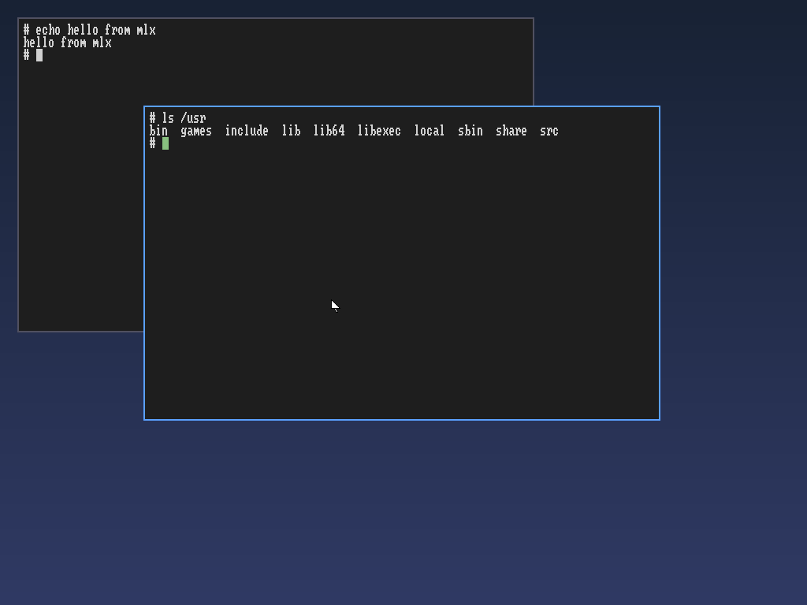
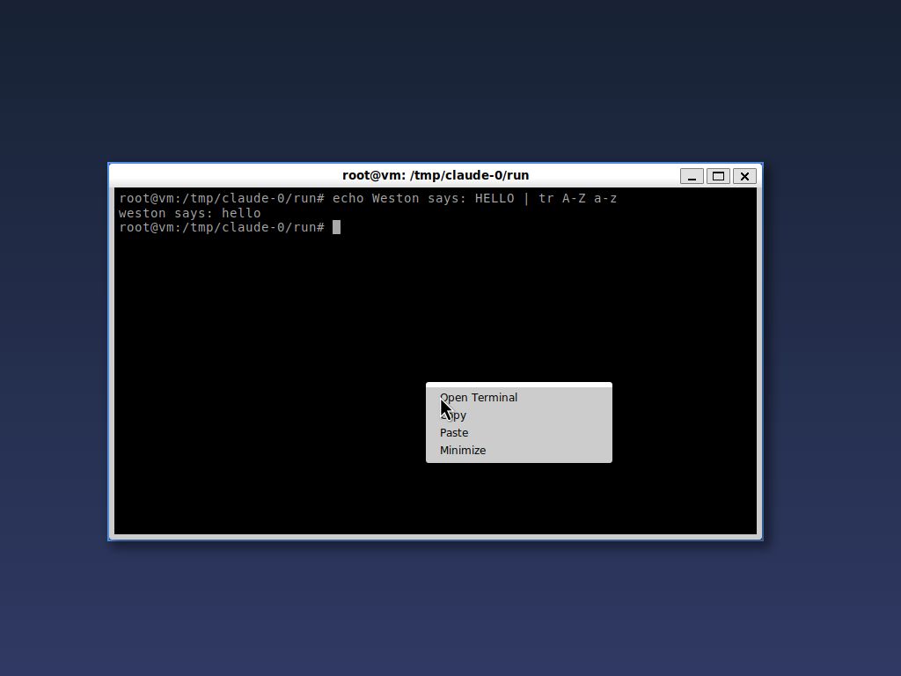
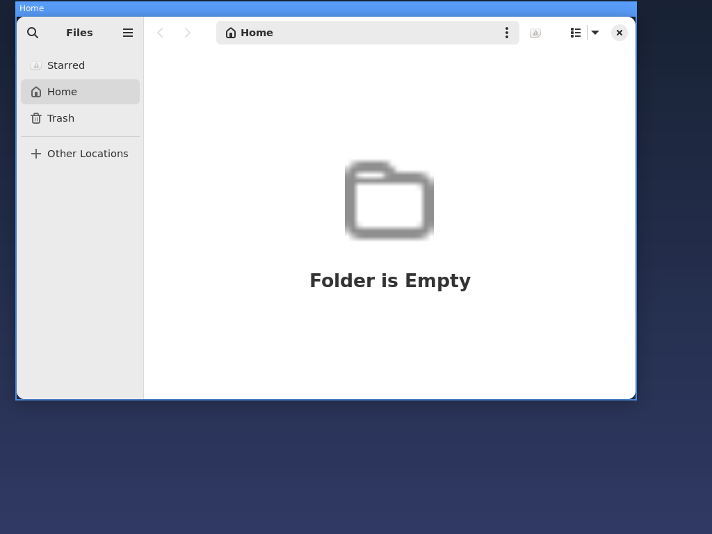
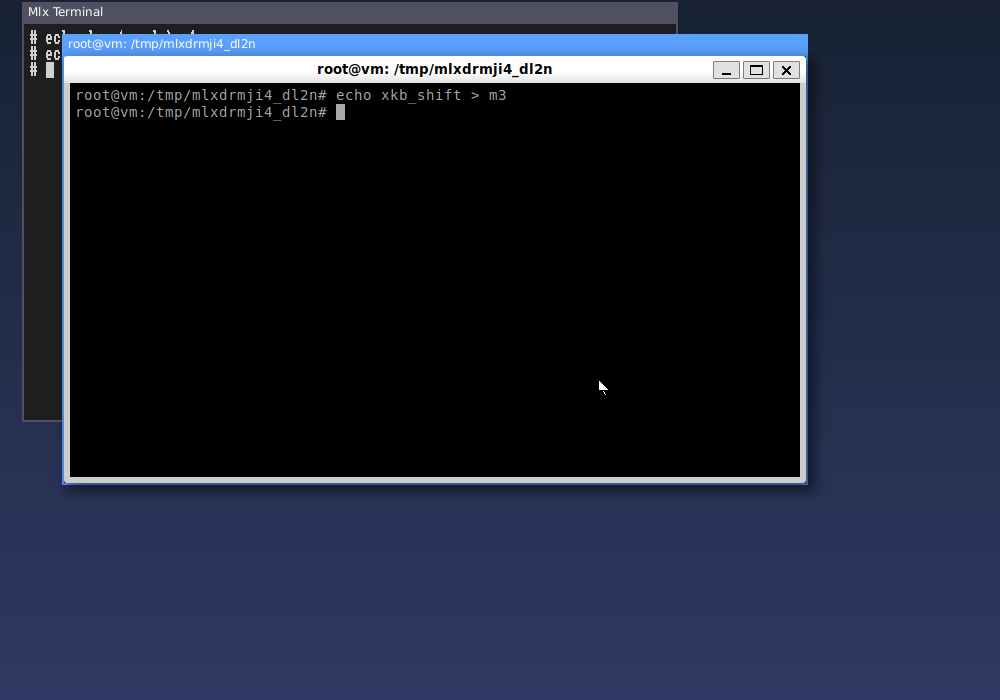
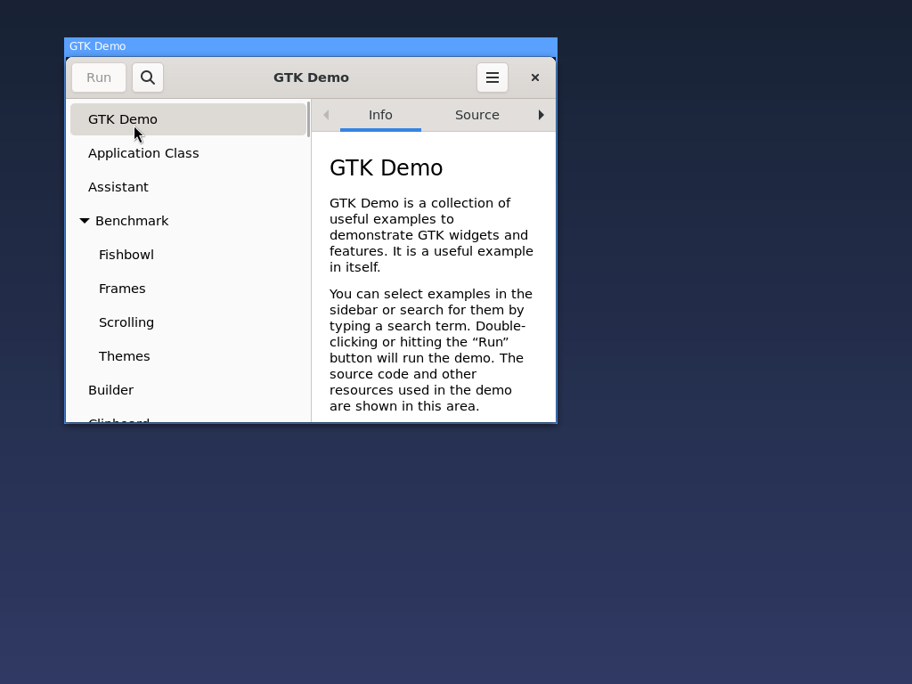
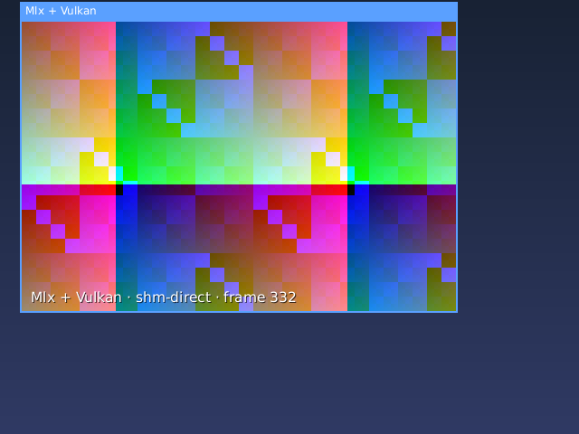

# Mlx Wayland compositor

A Wayland compositor written in Mlx with `std.wayland`. It runs either

- **freestanding**: it drives the monitor itself (DRM/KMS) and reads the
  keyboard, mouse and touchpad (evdev), as the desktop session a display
  manager (GDM, SDDM) starts, or from a text console; or
- **nested**: as a window inside your desktop session (any Wayland
  compositor).

Either way it is a compositor in its own right: programs started with its
`WAYLAND_DISPLAY` appear as windows inside it. It picks nested when it is
started inside a Wayland session, freestanding otherwise (`--backend
nested|drm` decides).

- Keyboard and pointer go to the clients: the pointer to the window under
  it, a click focuses and raises a window, and keys go to the focused
  window. Clients receive the xkb keymap (nested: the session's;
  freestanding: made with libxkbcommon for the system's layout) and the key
  repeat settings.
- Windows move by dragging their title bar (`xdg_toplevel.move`) or with
  Alt+drag anywhere.
- Windows resize by dragging their border (the cursor shows the
  direction; near a corner, the corner), with Alt+right-drag from the
  nearest corner, or from the client's own edges (`xdg_toplevel.resize`,
  GTK). The opposite edges stay where they are.
- Right-click menus and other `xdg_popup` windows are placed with
  `xdg_positioner` and dismissed by clicking elsewhere.





The screenshots are frames the scripted test host received, taken during
`tools/check_wayland_compositor.sh`-style runs.

| Shortcut | Action |
| --- | --- |
| Alt+Enter | open a terminal (`--terminal`, default `mlx-terminal`) |
| Alt+drag | move the window under the pointer |
| Alt+right-drag | resize the window under the pointer from its nearest corner |
| Alt+Tab | switch windows |
| Alt+F4 | close the focused window |
| Alt+Shift+Q | quit |
| Ctrl+Alt+F1 .. F12 | switch to that VT (freestanding) |
| Ctrl+Alt+Backspace | quit (freestanding) |

## Run it

From the repository root, with the self-hosted compiler built (see
`docs/internals/selfhost-compiler.md`):

```sh
mlx-out/bin/compiler/mlx4 examples/wayland-compositor/main.mlx -o mlx-compositor
mlx-out/bin/compiler/mlx4 examples/wayland-terminal/main.mlx -o mlx-terminal
./mlx-compositor --run ./mlx-terminal
```

Press Alt+Enter for more terminals. Any Wayland program works as well, for
example `WAYLAND_DISPLAY=wayland-mlx weston-terminal` or `--run foot`. The
compositor needs a Wayland session (GNOME, KDE Plasma, sway, ...). On X11,
start `weston` first and run it inside weston.

GTK 3 and GTK 4 applications run too, Nautilus for example:



Programs that run as a single D-Bus application (Nautilus, gnome-text-editor,
most GNOME apps) hand a new window to the copy already running in your
session, which opens it on your desktop instead. Start them on a D-Bus bus
of their own to get a new copy inside the compositor:

```sh
WAYLAND_DISPLAY=wayland-mlx dbus-run-session nautilus
```

Options: `--socket NAME`, `--size WxH`, `--fullscreen` (a fullscreen
window at the monitor's resolution), `--renderer auto|vulkan|cpu` (default
`auto`: Vulkan when a driver works, else the CPU), `--font PATH|none`,
`--terminal PROGRAM`, `--run PROGRAM` (repeatable), `--screenshot FILE`,
`--timeout SECONDS`, `--verbose`.

## Freestanding (DRM/KMS)



Without a Wayland session around it (or with `--backend drm`) the
compositor is the display server itself:

- **Session**: it becomes the controller of its systemd-logind session
  (`TakeControl`), over a small D-Bus client of its own
  ([`dbus.mlx`](dbus.mlx), [`logind.mlx`](logind.mlx)). logind puts the VT
  into graphics mode and hands out the DRM card and the input devices
  (`TakeDevice`), so no root is needed. Without logind (no system bus) the
  devices are opened directly, which needs the rights to them, and there is
  no VT switching.
- **Monitor** ([`kms.mlx`](kms.mlx)): the first card (`/dev/dri/cardN`)
  with a connected connector, at the monitor's preferred mode, on a CRTC
  one of the connector's encoders can drive. Two XRGB8888 dumb buffers are
  drawn into in turn and shown with page flips; the flip-complete events
  pace the frame callbacks, so clients draw at the monitor's refresh
  rate. On exit the CRTC gets back what it showed before.
- **Input** ([`evdev.mlx`](evdev.mlx)): every keyboard, mouse and touchpad
  under `/dev/input`, and those plugged in later (inotify). Mice move with
  a little acceleration and scroll 15 pixels a notch; touchpads move the
  pointer about 4 pixels per millimetre, scroll with two fingers (the
  content follows the fingers), click (two fingers: right click) and tap
  to click.
- **Keyboard** ([`xkb.mlx`](xkb.mlx)): libxkbcommon, loaded at run time,
  compiles the keymap for `XKB_DEFAULT_LAYOUT` (and `_VARIANT`, `_MODEL`,
  `_OPTIONS`; the session launcher sets them from the system settings) and
  follows the modifiers. Without it a keymap file can be given with
  `MLX_XKB_KEYMAP`.
- **VT switching**: Ctrl+Alt+F1..F12 asks logind to switch; while another
  VT is in front the card and the input devices are paused (keys and
  buttons still held are released), and coming back sets the CRTC up
  again.

Frames are composed by the GPU straight into the dumb buffer when a Vulkan
driver works (the default, `--renderer auto`): each dumb buffer is exported
as a dma-buf (`DRM_IOCTL_PRIME_HANDLE_TO_FD`) and imported into Vulkan,
and the blit shader writes rows the buffer's pitch apart (see
[Vulkan](#vulkan)). Otherwise, or with `--renderer cpu`, they are composed
on the CPU into memory of the compositor's own and copied into the dumb
buffer row by row (the buffer's pitch may be wider than a row). At a
monitor's resolution the GPU is what keeps the compositor responsive: CPU
composition of a 1920x1080 frame takes a good part of a 60 Hz frame time,
the GPU a fraction of it.

The screen never stays black for the renderer's sake: after the first
frame rendered into a dumb buffer the compositor looks at the buffer
through its own mapping, and when the GPU's pixels are not there (a driver
that imports the buffer but writes where the monitor does not scan out)
it renders into a buffer of its own and copies frames in from then on
(`renderer: the GPU's frame did not reach the dumb buffer; copying each
frame instead` in the log); a frame Vulkan cannot compose at all hands the
output to the CPU renderer for good.

`tools/check_compositor_drm.sh` runs all of this without hardware:
[`tools/fake_drm_session.py`](../../tools/fake_drm_session.py) plays the
kernel and logind at the lowest level the compositor uses (real device
nodes; a private dbus-daemon with an emulated logind; device descriptors
that are sockets speaking [`device.mlx`](device.mlx)'s frame protocol, so
every ioctl arrives with its number and argument bytes, is checked against
the kernel's structure layouts, and has the pointers inside it followed in
the compositor's memory; dumb buffers that are memfds, read back as frames).
Real clients connect: typing reaches the Mlx terminal and, through the
compositor's keymap, weston-terminal; the mouse, the touchpad and a mouse
plugged in later move the cursor; Ctrl+Alt+F2 pauses and resumes
everything; Alt+Shift+Q restores the console's CRTC and gives every
device back. `tools/check_compositor_drm.sh vulkan` runs the same with the
Vulkan renderer on lavapipe, which must export both dumb buffers as
dma-bufs and render into them (the harness answers PRIME with the buffer's
memfd), once more copying each frame in, as on drivers that cannot import
them, and once more with the first frame made to look missing from the
buffer, after which the renderer must copy.

## Desktop session (GDM, SDDM)

`tools/install_compositor_session.sh` builds the compositor and the
terminal and installs them as a session that GDM and SDDM offer at login:

```sh
tools/install_compositor_session.sh             # asks for sudo to install
tools/install_compositor_session.sh --uninstall
```

It puts `mlx-compositor`, `mlx-terminal` and `mlx-session` into
`/usr/local/bin` (`--prefix`) and `mlx-compositor.desktop` into
`/usr/share/wayland-sessions` (`--sessions`), where both display managers
look; `--destdir` stages everything for packaging, `--build-only` only
builds (into `mlx-out/session`). Then log out and pick "Mlx Compositor":
in GDM with the gear button once your user is chosen, in SDDM in the
session menu.

The session ([`session/mlx-session`](session/mlx-session)) runs the
compositor freestanding (above), at the monitor's preferred resolution,
with the system's keyboard layout (`localectl`, `/etc/default/keyboard` or
`/etc/vconsole.conf`; `XKB_DEFAULT_LAYOUT` wins), composed by the GPU when
a Vulkan driver works, else on the CPU (the log says which). Alt+Enter
opens a terminal, Ctrl+Alt+F1..F12 switch VTs, Alt+Shift+Q ends the
session, and everything the compositor logs (`--verbose`) goes to
`~/.local/state/mlx-compositor/session.log`, which is the place to look
when the session does not come up: it names the renderer, every window,
and, should the compositor die, the crash (below). `MLX_COMPOSITOR_ARGS`
adds options (`--renderer cpu` to stay on the CPU).

`MLX_SESSION_HOST=cage` or `weston` in the session's environment runs the
compositor nested instead, fullscreen in a minimal host that drives the
monitor: [cage](https://github.com/cage-kiosk/cage), or weston's kiosk
shell (weston 10 or newer). With `--fullscreen` the compositor binds the
host's `wl_output`, asks for a fullscreen window and takes the size the
host configures (the monitor's resolution; the mode divided by the scale
when the host only has a mode) before making its buffers; the host's
keymap is handed on to the clients.

Other programs started from the session's terminal share the session's
D-Bus bus, so a single-instance application already running elsewhere for
your user (Nautilus in another session) still opens its window there;
`dbus-run-session` gives it a bus of its own, as above.

`tools/check_compositor_session.sh` stages an install and starts the
nested variants of the session as a display manager would, with cage and
with weston on their headless backends: the compositor must come up at the
host monitor's resolution with the session's keyboard layout.

## Drawing only what changed

Every change to the scene reports the area it covers (a window moved,
raised or redrawn, the focus, the cursor, a popup placed), and a frame
draws only that: the CPU renderer composes the changed rectangle, and each
of the two output buffers is brought up to date in what it lacks (the
buffer shown two frames ago lacks two frames' changes; freestanding, the
changed rows of the compositor's own frame are copied into the dumb
buffer). Moving the pointer thus redraws a few hundred pixels rather than
the screen, and the frame after a client's commit only that window. The
Vulkan renderer redraws everything, which costs the GPU little.
`tests/268_compositor_damage_runtime.mlx` checks the bookkeeping against
frames composed from scratch. Composition itself works on whole pixels
and 64-bit words (`state.copyPixels`, `fillPixels`), copies opaque
windows' rows outright and blends the three channels of a translucent
pixel at once; a full 1920x1080 frame with an opaque window takes about 6
ms on the CPU where it took 88.

## Title bars

Every window gets a title bar above its frame (the focus color when it has
the keyboard) showing its `xdg_toplevel` title, drawn with
[`std.truetype`](../../docs/reference/truetype.md) from `--font` (default
DejaVu Sans; titles are left out when it cannot be read). Dragging a title
bar moves the window. Both renderers draw titles identically: the CPU with
`std.truetype.drawRun`, Vulkan with the `text` compute shader.

## Resizing

During a resize the window gets its new size in `xdg_toplevel.configure`
with the `resizing` state, one size at a time: the next goes out once the
client has acknowledged the last one and committed a buffer for it, so a
slow client is never flooded. Clients may snap to their own steps (the
terminals to whole cells); when a window grows from its left or top edge,
it is moved as its size arrives so that its right and bottom edges stay
put. Releasing the button sends the final size without `resizing`. Sizes
stay within the client's `set_min_size`/`set_max_size` and never go below
64 x 32. With `--verbose` the log shows each new window size.



## Vulkan

By default (`--renderer auto`, or `vulkan` to insist) the output is
composed on the GPU by the blit compute shader of `examples/vulkan-shared`,
through `std.vulkan` (no C loader; `VK_DRIVER_FILES` picks a driver),
nested and freestanding alike.
Client buffers are read where they are: `wl_shm` pools are imported as
host memory (`VK_EXT_external_memory_host`), linux-dmabuf buffers as
dma-bufs. The frame is written straight into the output: nested, the
buffer shown in the host window (its `wl_shm` pool imported as host
memory); freestanding, the DRM dumb buffer the monitor scans out (exported
as a dma-buf and imported with `VK_EXT_external_memory_dma_buf`, the
shader stepping rows by the buffer's pitch). A client buffer is therefore
kept until the client commits the next one, then released. The result is
pixel-identical to the CPU renderer.

Drivers that cannot import the output or that shared memory (RADV and the
other amdgpu drivers import only anonymous host memory, not the memfd
behind a `wl_shm` pool) use copies instead: the frame is rendered into a
host-cached buffer and copied into the output, row by row where the pitch
differs, and a `wl_shm` client buffer is uploaded into a per-window buffer
when the client commits new content. dma-bufs, the dumb buffers included,
are still imported where the driver can. `--verbose` says when this
happens (`renderer: ... copying each frame`); `MLX_VULKAN_NO_HOST_IMPORT=1`
takes this path on any driver.

`--renderer auto` (the default) falls back to the CPU renderer when no
driver works (`mlx-compositor: no usable Vulkan driver; composing on the
CPU`), and so does a running compositor whose driver fails to compose a
frame (`Vulkan could not compose a frame; composing on the CPU from now
on`): the buffers its windows show are copied and the CPU carries on.
`--renderer cpu` never opens a driver.

## When it crashes

A failed runtime check (an index out of range, an unsigned subtraction
below zero, an overflow) is compiled to an illegal instruction. The
compositor catches that, and the other fatal signals, and says so before
it dies: `mlx-compositor: crashed: illegal instruction (...) at 0x4a12f3;
stack: ...`, with the addresses of the instruction and the words on top
of the stack. The compiler builds the same binary from the same sources,
so that address finds the place in a disassembly of a fresh build
(`objdump -d mlx-compositor`); please include the line in a bug report,
with the commit the compositor was built from.

When the compositor stops on its own it says why: for example
`mlx-compositor: lost the session compositor: the server reported a
protocol error (object 12, code 3): ...`, or that the Wayland socket is
taken (`--socket NAME` picks another).



```sh
mlx4 examples/vulkan-wayland-client/main.mlx -o vulkan-wayland-client
./mlx-compositor --renderer vulkan --run ./vulkan-wayland-client
```

## Supported protocol

`wl_compositor` (surfaces and regions), `wl_shm` (ARGB8888 and XRGB8888),
`zwp_linux_dmabuf_v1` version 3 (ARGB8888 and XRGB8888, linear, one plane),
`wl_output`, `wl_seat` with pointer and keyboard, `wl_data_device_manager`
version 3 and `xdg_wm_base` with toplevels (with `configure_bounds`: the
output's size), popups and positioners. There are no subsurfaces.
Composition is done in software, or with Vulkan (`--renderer vulkan`).

## Copy and paste

`wl_data_device_manager` carries the clipboard between clients (GTK 4
refuses a display without it): the selection is the data source a client
set last, the focused client receives it as a data offer (when it gains
focus and when the selection changes), and reading an offer passes the
reader's pipe to the source's client, which writes the data into it.
Drag and drop is not supported: the source of a drag is cancelled at
once.

## Files

- `main.mlx`: options, the backend choice, the child environment and the
  event loops (nested: the host connection and the server; freestanding:
  the server and the devices).
- `host.mlx`: the nested backend, a window on the session compositor
  (fullscreen at the monitor's resolution with `--fullscreen`) and its seat
  input.
- `drm.mlx`: the freestanding backend: session, monitor, input devices,
  frames and VT switching, with `kms.mlx` (DRM/KMS), `evdev.mlx` (input
  devices), `xkb.mlx` (keymap and modifiers), `logind.mlx` (the login
  session), `dbus.mlx` (a small D-Bus client) and `device.mlx` (device
  syscalls, and the emulated devices of the test harness).
- `shell.mlx`: the server side, with globals, surfaces, shared memory,
  xdg-shell, focus and input delivery, and launching programs.
- `dmabuf.mlx`: linux-dmabuf; each dma-buf becomes a one-buffer pool.
- `data.mlx`: `wl_data_device_manager`, copy and paste between clients.
- `session/`: the desktop session's launcher and entry
  (`tools/install_compositor_session.sh` installs them).
- `vulkan.mlx`: the Vulkan renderer.
- `scene.mlx`: stacking, hit-testing, title bars, damage tracking and
  software composition.
- `state.mlx`: shared records and list helpers.

`tools/check_wayland_compositor.sh [compiler] [cpu|vulkan]` exercises all
of this with scripted input (`tools/wayland-test-host`) on either renderer,
with copy and paste between two clients (`wl-copy`, `wl-paste`) and a GTK 4
window (`gtk4-widget-factory`) when those are installed;
`tools/check_vulkan_wayland.sh` checks the Vulkan client in both renderers
over `wl_shm` and linux-dmabuf, pixel by pixel.
