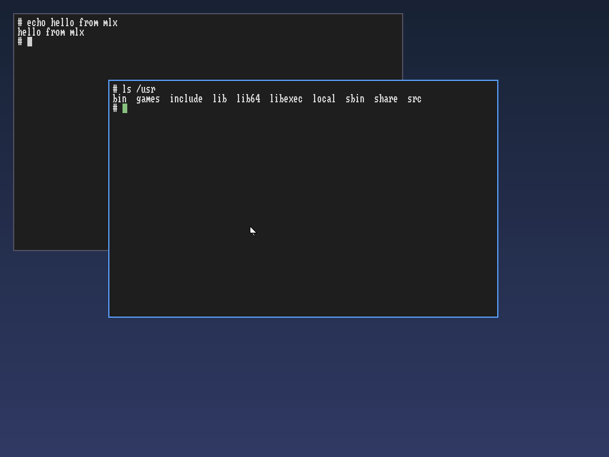
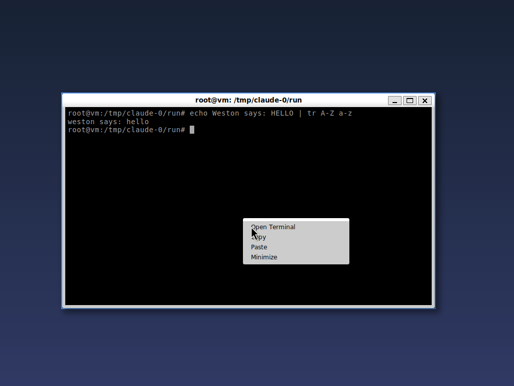
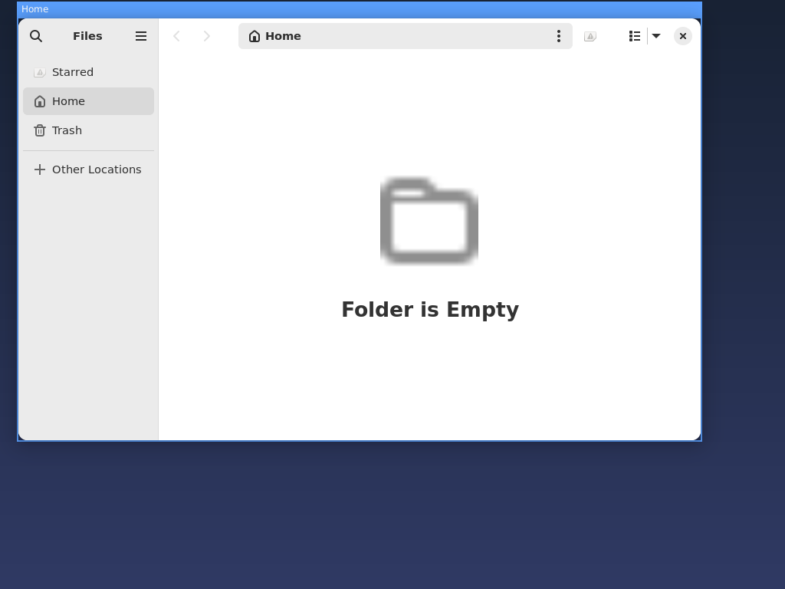
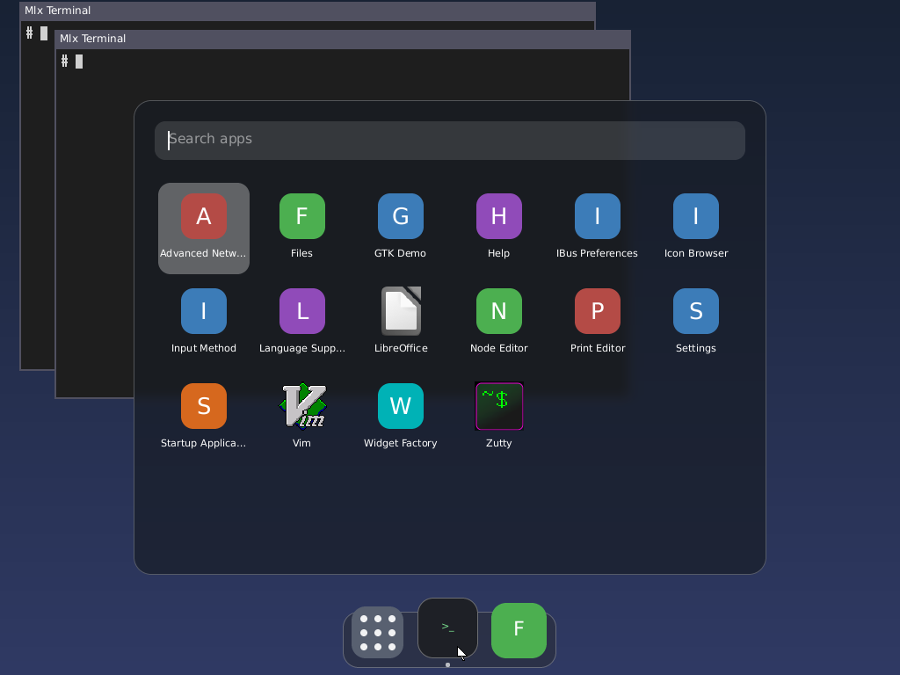
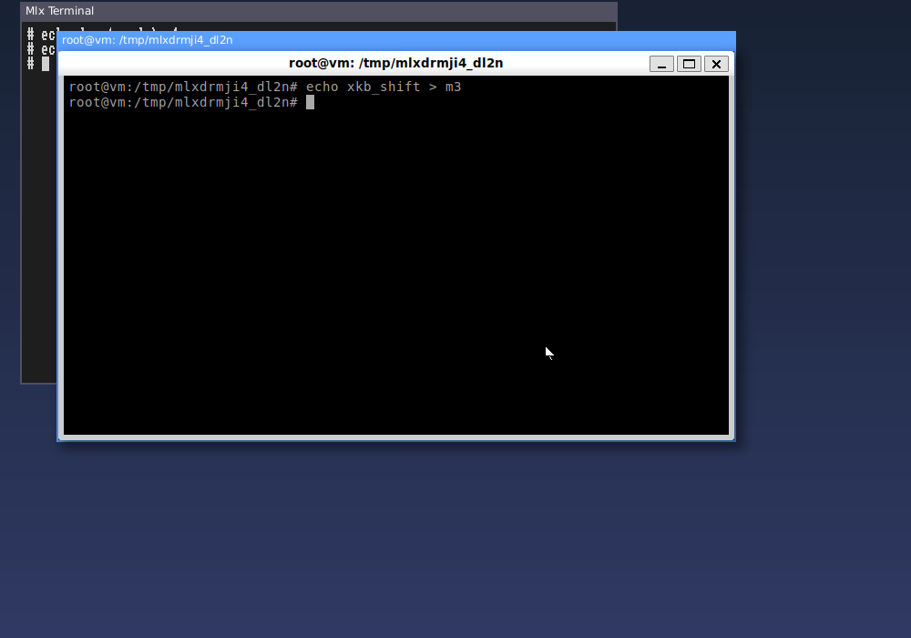
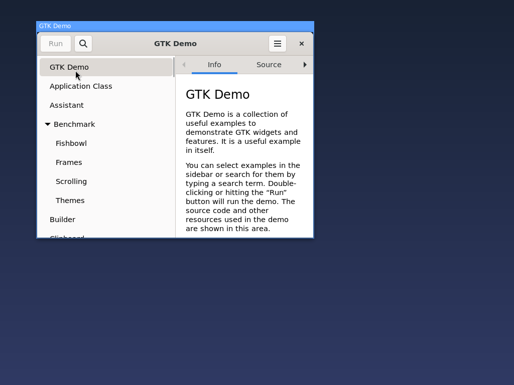
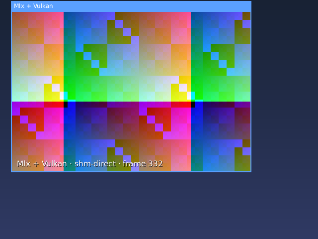

# Mlx Wayland compositor

A Wayland compositor written in Mlx with `std.wayland`. It runs either

- **freestanding**: it drives the monitor itself (DRM/KMS) and reads the
  keyboard, mouse and touchpad (evdev), as the desktop session a display
  manager (GDM, SDDM) starts, or from a text console; or
- **nested**: as a window inside your desktop session (any Wayland
  compositor).

Either way it is a compositor in its own right: programs started with its
`WAYLAND_DISPLAY` appear as windows inside it. It picks nested when it is
started inside a Wayland session, freestanding otherwise (`--backend
nested|drm` decides).

- Keyboard and pointer go to the clients: the pointer to the window under
  it, a click focuses and raises a window, and keys go to the focused
  window. Clients receive the xkb keymap (nested: the session's;
  freestanding: compiled by std.xkb for the system's layout) and the key
  repeat settings.
- Windows move by dragging their title bar (`xdg_toplevel.move`) or with
  Alt+drag anywhere.
- Windows resize by dragging their border (the cursor shows the
  direction; near a corner, the corner), with Alt+right-drag from the
  nearest corner, or from the client's own edges (`xdg_toplevel.resize`,
  GTK). The opposite edges stay where they are.
- Right-click menus and other `xdg_popup` windows are placed with
  `xdg_positioner` and dismissed by clicking elsewhere.
- A dock and an app launcher, both Wayland clients of it (see Dock and
  launcher): Super opens the launcher in the middle of the screen.





The screenshots are frames the scripted test host received, taken during
`tools/check_wayland_compositor.sh`-style runs.

| Shortcut | Action |
| --- | --- |
| Super | open or close the app launcher (`--launcher`, default `mlx-launcher`) |
| Alt+Enter | open a terminal (`--terminal`, default `mlx-terminal`) |
| Alt+drag | move the window under the pointer |
| Alt+right-drag | resize the window under the pointer from its nearest corner |
| Alt+Tab | switch windows |
| Alt+F4 | close the focused window |
| Alt+Shift+Q | quit |
| Ctrl+Alt+F1 .. F12 | switch to that VT (freestanding) |
| Ctrl+Alt+Backspace | quit (freestanding) |

## Run it

From the repository root, with the self-hosted compiler built (see
`docs/internals/selfhost-compiler.md`):

```sh
mlx-out/bin/compiler/mlx4 projects/desktop/compositor/main.mlx -o mlx-compositor
mlx-out/bin/compiler/mlx4 projects/desktop/terminal/main.mlx -o mlx-terminal
./mlx-compositor --run ./mlx-terminal
```

Press Alt+Enter for more terminals. Any Wayland program works as well, for
example `WAYLAND_DISPLAY=wayland-mlx weston-terminal` or `--run foot`. The
compositor needs a Wayland session (GNOME, KDE Plasma, sway, ...). On X11,
start `weston` first and run it inside weston.

GTK 3 and GTK 4 applications run too, Nautilus for example:



Programs that run as a single D-Bus application (Nautilus, gnome-text-editor,
most GNOME apps) hand a new window to the copy already running in your
session, which opens it on your desktop instead. Start them on a D-Bus bus
of their own to get a new copy inside the compositor:

```sh
WAYLAND_DISPLAY=wayland-mlx dbus-run-session nautilus
```

Options: `--socket NAME`, `--size WxH`, `--fullscreen` (a fullscreen
window at the monitor's resolution), `--renderer auto|vulkan|cpu` (default
`auto`: Vulkan when a driver works, else the CPU), `--font PATH|none`,
`--terminal PROGRAM`, `--launcher PROGRAM|none` (what Super starts),
`--dock PROGRAM|none` (the dock, kept running), `--topbar PROGRAM|none`
(the top bar, kept running), `--xwayland PROGRAM|none` (X programs, see
X programs), `--run PROGRAM`
(repeatable), `--screenshot FILE`, `--timeout SECONDS`, `--no-fps` (no
frames-per-second counters in the title bars), `--verbose` (which also
logs, once a second, `perf:` lines with the frame rate and how long a
frame takes to compose and present).

Each title bar shows the window's frames per second (the buffers it
committed) and the desktop's (frames shown). Shown frames follow the
monitor: at 60 Hz the desktop shows at most 60.

## Dock and launcher



Both are ordinary Wayland clients in [`projects/desktop/dock`](../dock/main.mlx)
and [`projects/desktop/launcher`](../launcher/main.mlx) (like
[`projects/desktop/settings`](../settings/main.mlx)), sharing
[`projects/desktop/shared`](../shared): the layer surface or window
and its input (`panel.mlx`, with `panel_input.mlx`, `panel_frames.mlx`,
popup menus in `panel_menu.mlx` and drag and drop in `panel_drag.mlx`), the keymap (`keyboard.mlx`),
desktop entries and their PNG icons (`apps.mlx`, with `std.png`) and the
per-turn value release (`turns.mlx`). They draw with Vulkan, the
desktop's standard for every app: `std.ui.canvas` records what it is
asked to draw and `std.ui.gpu_canvas` has the `paint` compute shader draw it all in
one pass, into buffers handed to the compositor as dma-bufs
(linux-dmabuf, ARGB8888, in device memory the compositor can map), or,
where the driver cannot export them (lavapipe), straight into the shared
memory it imports. Each app logs how (`mlx-dock: drawing on the gpu, into
dma-bufs (DEVICE)`). Without Vulkan, or with `MLX_CANVAS=cpu`, they draw
the same pixels on the CPU. The compositor offers them three protocols:

- `zwlr_layer_shell_v1` (wlr-layer-shell): surfaces in four layers
  (background, bottom, top, overlay; windows sit between bottom and top),
  anchored to edges or centred, with margins. A surface with an exclusive
  zone keeps its strip free: new windows are placed beside it and a
  window's bounds leave it out. A surface that asks for the keyboard
  exclusively in the top or overlay layer keeps it until it goes.
- `zwlr_foreign_toplevel_manager_v1` (wlr-foreign-toplevel-management):
  every window with its title, app id and whether it is active; a client
  can activate (focus and raise) or close one.
- `ext_background_effect_manager_v1`: a surface names a region where what
  is behind it is blurred (three box blurs, radius 6) before the surface
  is drawn over it. The CPU and the Vulkan renderer blur alike, pixel for
  pixel.

Super, pressed and released on its own, shows the launcher, or closes it
when it is open (a Super shortcut with another key does neither). The
compositor starts the launcher with itself and keeps it running hidden,
with everything loaded (apps, fonts, icons): it hands it one end of a
socket pair (`MLX_LAUNCHER_FD`), and Super sends it one byte, so it shows
within a frame. Closing it only hides it; when it went away, the next
Super starts it again. The
launcher is a surface in the overlay layer, centred, that takes the
keyboard: typing narrows the apps (by name, id and command; names that
start with the text first), the arrow keys, Page Up/Down, Home and End
choose, Enter or a click starts the app (in `$MLX_TERMINAL` when its entry
says `Terminal=true`), Escape, Super or a click outside close it.

The dock sits in the top layer along the bottom edge with an exclusive
zone. Like the launcher it is a helper the compositor starts with itself
(`--dock PROGRAM|none`, default `mlx-dock` next to the compositor) and
keeps running: when it ends it is started again (three times at most when
it keeps ending within five seconds). Its apps button asks the compositor
for the launcher on its own socket pair (`MLX_DOCK_FD`), so the launcher
that stays shows at once (a second click closes it). Both look every few
seconds (the launcher also whenever it is shown) whether apps were
installed or removed (the application directories' modification times)
and the dock whether `~/.config/mlx/dock` changed, and take the changes in.
It shows an apps button, the pinned apps,
and after a separator the apps that have windows but are not pinned; a dot
marks an app that runs. Icons grow under the pointer, which shows the
app's name. A click brings the app's window forward or starts it. When the
app has several windows the dock asks the compositor for their previews
(over the same socket pair: the handles' object ids): a panel above the
dock with each window scaled down, whole with its frame and title bar on
the Vulkan renderer (drawn flat into the scratch buffer, then shrunk by
the `shrink` kernel, 4x4 samples a pixel), its contents on the CPU, and
the titles below. The thumbnail under the pointer is highlighted; a
click on one brings its window forward (a minimized one comes back), a
click anywhere else, Escape or a second click on the icon closes them.
The thumbnails follow their windows as they draw.

A right click on a dock icon opens its menu (an xdg_popup on the dock's
layer surface): the app's own actions from its desktop entry (Firefox's
"New Window" and "New Private Window"; an app without any gets "New
Window"), "Pin to Dock" or "Unpin from Dock", and "Close Window" or
"Close All Windows" while it runs. In the launcher a right click on an
app offers its actions and pinning too, and an app dragged from the
launcher onto the dock is pinned where it is dropped (dropped again, it
moves there); the dock takes `text/uri-list` drops of desktop entry
files, so one dragged from a file manager works as well. Both write
`~/.config/mlx/dock`, which the dock takes in within a second (it writes
its defaults there when the file is missing).

After a second separator come folders and the trash, as on macOS. The
folders are listed in `~/.config/mlx/dock-folders` (`~/Downloads` when
the file is missing); a click on one shows it as a stack: a popup grid of
its files and folders, newest first, with icons by type (pictures from
the freedesktop thumbnail cache, `~/.cache/thumbnails`, which Dolphin and
Nautilus fill too; a PNG without one gets it from a worker process,
`desktop-shared/thumbs.mlx`, so a folder of big screenshots opens at once
and its pictures come in as they are made), scrolled with the wheel, and "Open" above (a click on an entry
opens it). A right click offers "Open" and "Remove from Dock", and a
folder dragged onto the dock from a file manager joins them. The trash
(`$XDG_DATA_HOME/Trash`) shows whether it holds anything; a click opens
it in the file manager (asked over D-Bus, `org.freedesktop.FileManager1`,
else its directory with `xdg-open`: `xdg-open trash:///` would reach the
browser), its menu empties it, and files dropped on it go into it (`gio
trash`; an app dragged from the launcher does not). A folder opened from
the stack (its Open button, or a folder in it) opens in the file manager
out of the stack, as on macOS: the dock keeps the stack up and tells the
compositor a window is coming (`z` on its socket pair); the next window
to map within three seconds starts at the stack's size and place, the
stack goes in that same frame, and the window grows to where it rests in
a third of a second, easing out and fading in (`zoom:` in the log). On
the Vulkan renderer the window is drawn flat into the scratch buffer and
scaled by the previews' `shrink` kernel (with an opacity); the CPU
renderer scales its buffer (nearest pixel) inside the frame's colour. The
trash and a folder's "Open" grow their window out of the icon (`Z` and
the icon's rectangle). Should the dock
crash, it says where first (`mlx-dock: crashed: ...` and the functions,
in the compositor's log), as the compositor does, and keeps the crash
for MLX Observatory.

With `dock-autohide = on` (mlx-settings: "Auto-hide dock") the dock
reserves no space, so maximized windows reach the bottom edge. It slides
out of sight once the pointer has been away from it for 0.6 seconds and
back up when the pointer touches the output's bottom edge; it stays while
its previews show or a button is held.

The top bar (`mlx-topbar`, `--topbar PROGRAM|none`, started and kept
running like the dock over `MLX_TOPBAR_FD`) sits in the top layer along
the top edge, 30 pixels high with an exclusive zone, as the menu bar of
macOS: maximized windows start below it and windows placed under it are
moved down. It is translucent over a blur and shows a mark and the name
of the active window's app on the left (its desktop entry's name, else
its app id or title) and the date and time on the right ("So. 27. Sep.
16:05" when `LC_ALL`, `LC_TIME` or `LANG` is German, else "Sun 27 Sep
16:05"). The time zone comes from `$TZ` (a zone name looked up in
`/usr/share/zoneinfo`, a file, or a POSIX rule such as
`CET-1CEST,M3.5.0,M10.5.0/3`), else `/etc/localtime`; the TZif files
and their rules for the years after the table are read by
`desktop-shared/clock.mlx`. `MLX_SESSION_TOPBAR=no` starts the session
without it.

The file manager, [`projects/desktop/files`](../files/main.mlx) (Files in
the launcher, pinned in the dock by default), is laid out like the Finder:
a translucent sidebar with the home folder, the user's folders
(`~/.config/user-dirs.dirs`: Dokumente, Bilder on a German system), the
computer and the trash; a toolbar with back and forward, the folder's
name, icons or list and a search field; the files as icons (pictures from the
thumbnail cache, as in the dock's stacks) or as a list with the date modified, the size and the kind (a
click on a column sorts by it); and a status bar with the path to click
on and how many items there are. Folders come first and names sort as
people count ("Project 2" before "Project 10"). A click selects (Ctrl
adds, Shift a range, a rectangle dragged over empty space selects what it
touches), a double click or Enter opens (a file with `xdg-open`). F2
renames (the name before its extension selected), Ctrl+Shift+N makes a
folder, Delete moves to the trash (`gio trash`), Ctrl+C, Ctrl+X and
Ctrl+V copy, cut and paste within it, Ctrl+F searches, Ctrl+H shows hidden
files, Backspace or Alt+Left goes back, Alt+Up to the parent; typing jumps
to a name. The right-click menu offers these, "Add to Dock" for a folder,
"Open in Terminal", and in the trash "Put Back" and "Delete Immediately".
Files dragged out go as `text/uri-list` (onto the dock's trash, into
another folder); files dropped in are copied, its own moved. It reads a
folder again within a second when it changes, and its labels and dates
follow the locale. `mlx-files PATH`, `file://` URIs and `trash:///` open
it where asked; the dock opens its folders and the trash in it when it is
installed.

MLX Observatory, [`projects/observatory`](../../observatory/README.md), flies
through the code of this repository in 3D, laid out like the file manager.
Folders are groups, with their files and those files' declarations around
them. Lines show what is in what and what imports what; a selection shows
what it calls, uses and imports, and what calls, uses and imports it, with
its signature and doc comment. It draws with a compute shader under the
canvas (the panel's `scene` hook), or on the CPU.

mlx-settings lists the hotkeys: a click on one records the next key
combination (Escape keeps the old one, Backspace unbinds it, a right click
restores the default). Meanwhile the compositor passes every key to it,
Super and its own hotkeys too (keyboard-shortcuts-inhibit-unstable-v1,
which any client may use while it has the keyboard); Alt+Shift+Q and the
VT switch stay the compositor's. `~/.config/mlx/dock` lists the pinned apps, one
desktop entry id per line (`org.gnome.Nautilus`, `firefox`), `terminal` for
the Mlx terminal; without it the dock pins the terminal and the first file
manager (mlx-files first), browser and editor it finds. Icons are PNGs (the hicolor theme or
`/usr/share/pixmaps`); an app with only an SVG icon gets a tile with its
initial.

The compositor passes `MLX_TERMINAL` (its `--terminal`) and `MLX_LAUNCHER`
(its `--launcher`) to its clients. The session starts the dock
(`MLX_SESSION_DOCK=no` does not). `tools/check_desktop_clients.sh`
checks both clients with scripted input on the CPU and the Vulkan
renderer: where their surfaces are, Super, typing, starting apps from both,
switching windows from the dock's previews, the blur, and that both
renderers draw the same pixels; and the file manager making, renaming,
moving and trashing files.

## Freestanding (DRM/KMS)



Without a Wayland session around it (or with `--backend drm`) the
compositor is the display server itself:

- **Session**: it becomes the controller of its systemd-logind session
  (`TakeControl`), over a small D-Bus client of its own
  ([`dbus.mlx`](dbus.mlx), [`logind.mlx`](logind.mlx)). logind puts the VT
  into graphics mode and hands out the DRM card and the input devices
  (`TakeDevice`), so no root is needed. Without logind (no system bus) the
  devices are opened directly, which needs the rights to them, and there is
  no VT switching.
- **Monitor** ([`kms.mlx`](kms.mlx)): one card (`/dev/dri/cardN`) with a
  connected connector, at the monitor's native resolution (that of its
  preferred mode) with the highest refresh rate it offers there (monitors
  mark a 60 Hz mode preferred even when they do 144 Hz;
  `MLX_DRM_REFRESH=HZ` sets an upper limit), or at the settings'
  `display-mode` when the monitor offers it (see [Display and night
  light](#display-and-night-light)), on a CRTC one of the
  connector's encoders can drive. With several cards each is looked
  at and logged (`drm: /dev/dri/card1: VGA-1 1024x768 at 60 Hz (the boot
  card)`, `drm: /dev/dri/card2: DP-1 3840x1080 at 60 Hz`), and the one
  with the largest monitor is driven (a server's BMC graphics, ASPEED for
  one, reports a small VGA "monitor" and is often the boot card), then the
  boot card, then the first; `MLX_DRM_CARD=/dev/dri/cardN` (or just `N`)
  in the environment picks another. Only that card's monitor is driven;
  the others stay dark. Two XRGB8888 dumb buffers are drawn into
  in turn and shown with page flips; the flip-complete events pace the
  frame callbacks, so clients draw at the monitor's refresh rate. On exit
  the CRTC gets back what it showed before, its gamma table too.
- **Input** ([`evdev.mlx`](evdev.mlx)): every keyboard, mouse and touchpad
  under `/dev/input`, and those plugged in later (inotify). Mice move with
  a little acceleration and scroll 15 pixels a notch; touchpads move the
  pointer about 4 pixels per millimetre, scroll with two fingers (the
  content follows the fingers), click (two fingers: right click) and tap
  to click.
- **Keyboard** ([`xkb.mlx`](xkb.mlx)): `std.xkb` compiles the keymap from
  the XKB data (`/usr/share/X11/xkb`) for `XKB_DEFAULT_LAYOUT` (and
  `_VARIANT`, `_MODEL`, `_OPTIONS`; the session launcher sets them from the
  system settings) as libxkbcommon would, without it, and follows the
  modifiers through every key's action. A keymap file can be given instead
  with `MLX_XKB_KEYMAP`.
- **VT switching**: Ctrl+Alt+F1..F12 asks logind to switch; while another
  VT is in front logind pauses the card and the input devices (keys and
  buttons still held are released), and coming back sets the CRTC up
  again. The pause itself never stops the compositor from drawing: it
  keeps presenting, and the kernel refuses the frames while the card is
  not ours (`drm: page flip failed (errno 13; the card is paused); trying
  again`, once), so a pause whose resume never arrives, as seen during
  SDDM's hand-over from its greeter, cannot leave the screen black. The
  log names each pause's kind and the VT in front (`session: the card is
  paused (asked, tty2 in front, ours is tty1)`).

Frames are composed by the GPU straight into the dumb buffer when a Vulkan
driver works (the default, `--renderer auto`): each dumb buffer is exported
as a dma-buf (`DRM_IOCTL_PRIME_HANDLE_TO_FD`) and imported into Vulkan,
and the blit shader writes rows the buffer's pitch apart (see
[Vulkan](#vulkan)). Otherwise, or with `--renderer cpu`, they are composed
on the CPU into memory of the compositor's own and copied into the dumb
buffer row by row (the buffer's pitch may be wider than a row). At a
monitor's resolution the GPU is what keeps the compositor responsive: CPU
composition of a 1920x1080 frame takes a good part of a 60 Hz frame time,
the GPU a fraction of it.

The screen never stays black for the renderer's sake: after the first
frame rendered into a dumb buffer the compositor looks at the buffer
through its own mapping, and when the GPU's pixels are not there (a driver
that imports the buffer but writes where the monitor does not scan out)
it renders into a buffer of its own and copies frames in from then on
(`renderer: the GPU's frame did not reach the dumb buffer; copying each
frame instead` in the log); a frame Vulkan cannot compose at all hands the
output to the CPU renderer for good.

`tools/check_compositor_drm.sh` runs all of this without hardware:
[`tools/fake_drm_session.py`](../../../tools/fake_drm_session.py) plays the
kernel and logind at the lowest level the compositor uses (real device
nodes; a private dbus-daemon with an emulated logind; device descriptors
that are sockets speaking [`device.mlx`](device.mlx)'s frame protocol, so
every ioctl arrives with its number and argument bytes, is checked against
the kernel's structure layouts, and has the pointers inside it followed in
the compositor's memory; dumb buffers that are memfds, read back as frames).
Real clients connect: typing reaches the Mlx terminal and, through the
compositor's keymap, weston-terminal; the mouse, the touchpad and a mouse
plugged in later move the cursor; Ctrl+Alt+F2 pauses and resumes
everything; Alt+Shift+Q restores the console's CRTC and gives every
device back. The settings file asks for the monitor's size at 50 Hz
instead of its preferred 60 and for night light: the CRTC must be set to
that mode, `wayland-drm.display` must list the connector's modes, and
the gamma table must be warmed from the console's (3000 K, then 2000 K
when the file changes), set again after the VT switch (the other session
put its own) and put back at the end. `tools/check_compositor_drm.sh vulkan` runs the same with the
Vulkan renderer on lavapipe, which must export both dumb buffers as
dma-bufs and render into them (the harness answers PRIME with the buffer's
memfd), once more copying each frame in, as on drivers that cannot import
them, and once more with the first frame made to look missing from the
buffer, after which the renderer must copy.

## Desktop session (GDM, SDDM)

`install_compositor.sh` at the repository root builds the compositor and
the terminal, installs them into `/usr/bin` as a session that GDM and SDDM
offer at login, and then checks the installation and the machine:

```sh
./install_compositor.sh                # build, install (asks for sudo), check
./install_compositor.sh --check        # check an installation and the machine
./install_compositor.sh --log          # the last session log
./install_compositor.sh --uninstall
```

The checks cover the three programs and the session entry (whose `Exec`
and `TryExec` must resolve, or the login screen hides the session), the
display manager, the system bus for logind, the DRM cards and their
connected connectors, the `video` and `input` groups (needed only without
logind), the Vulkan drivers, the XKB data, and the last session log,
whose `modeset failed`, `crashed:` or `killed by signal` lines it points
out. It wraps `tools/install_compositor_session.sh`, which does the
building and copying (`--prefix`, default `/usr/local` there; `--destdir`
stages for packaging; `--build-only` builds into `mlx-out/session`). The
build uses the canonical compiler, `mlx-out/bin/compiler/mlx4`, and makes
it first from the bootstrap-built `zig-out/bin/mlx1` when it is missing
(`mlx1 -> mlx2 -> mlx3`, the self-hosted compiler's fixed point): that
compiler builds the same binary from the same sources on every machine,
so the checksum `--check` prints matches a build elsewhere, and a crash
address from one machine finds its place in another's disassembly.

It puts `mlx-compositor`, `mlx-terminal` and `mlx-session` into
`/usr/local/bin` (`--prefix`) and `mlx-compositor.desktop` into
`/usr/share/wayland-sessions` (`--sessions`), where both display managers
look; `--destdir` stages everything for packaging, `--build-only` only
builds (into `mlx-out/session`). Then log out and pick "Mlx Compositor":
in GDM with the gear button once your user is chosen, in SDDM in the
session menu.

The session ([`session/mlx-session`](session/mlx-session)) runs the
compositor freestanding (above), at the monitor's preferred resolution,
with the system's keyboard layout (`localectl`, `/etc/default/keyboard` or
`/etc/vconsole.conf`; `XKB_DEFAULT_LAYOUT` wins), composed by the GPU when
a Vulkan driver works, else on the CPU (the log says which). Alt+Enter
opens a terminal, Ctrl+Alt+F1..F12 switch VTs, Alt+Shift+Q ends the
session. `MLX_SESSION_RENDERER` picks the renderer: `auto` (the default:
Vulkan when a driver works, else the CPU), `vulkan` (Vulkan or nothing)
or `cpu`; `MLX_COMPOSITOR_ARGS` adds other options. (`--backend drm` in
the log is the other, independent choice: the compositor drives the
monitor itself, which is what makes it a session of its own.)

The session log is `~/.config/mlx/compositor.log` (`MLX_SESSION_LOG`
names another file; the previous run's log is kept as
`compositor.log.old`). It is the place to look when the session does not
come up. It starts with the environment the display manager gave the
session (user, `XDG_SESSION_ID`, seat and VT, the logind session's type
and activity, the system bus, the DRM devices, the Vulkan drivers
installed, a checksum of the compositor binary), then holds everything
the compositor prints with `--verbose`: the card and mode it took
(`drm: /dev/dri/card1 3840x1080 at 60 Hz`), the renderer, `drm: first
frame on screen` once the monitor shows a frame, or `drm: modeset failed
(errno N); nothing shown yet, trying again` when the kernel refuses the
mode (13 is EACCES: the card is not ours, 22 EINVAL: the mode or buffer),
every window, and how it all ended (`mlx-compositor exited with status N`
or `was killed by signal N`, with the crash line below when there was
one). A compositor that crashes within its first 20 seconds, or gives up
that early while composing with Vulkan, is started once more with
`--renderer cpu`, so a Vulkan-only failure still leaves a working
session, and the log shows both attempts.

When even that log does not appear, `/tmp/mlx-session-UID.log` says
whether the launcher was started at all (its first line is written before
anything else), and `./install_compositor.sh --log` shows both files and
the display manager's journal lines about the session.

A compositor started by hand, `mlx-compositor --backend drm` from a text
console, writes the same log itself (the console it was started from is
the monitor it draws on): `MLX_COMPOSITOR_LOG` names the file, `-` keeps
stdout, the default is `~/.config/mlx/compositor.log`, and `--verbose` is
implied. Starting the session from a text console works too: log in on
one (Ctrl+Alt+F3) and run `mlx-session`.

`MLX_SESSION_HOST=cage` or `weston` in the session's environment runs the
compositor nested instead, fullscreen in a minimal host that drives the
monitor: [cage](https://github.com/cage-kiosk/cage), or weston's kiosk
shell (weston 10 or newer). With `--fullscreen` the compositor binds the
host's `wl_output`, asks for a fullscreen window and takes the size the
host configures (the monitor's resolution; the mode divided by the scale
when the host only has a mode) before making its buffers; the host's
keymap is handed on to the clients.

Other programs started from the session's terminal share the session's
D-Bus bus, so a single-instance application already running elsewhere for
your user (Nautilus in another session) still opens its window there;
`dbus-run-session` gives it a bus of its own, as above.

`tools/check_compositor_session.sh` stages an install and starts the
nested variants of the session as a display manager would, with cage and
with weston on their headless backends: the compositor must come up at the
host monitor's resolution with the session's keyboard layout.

## Settings

`~/.config/mlx/compositor.conf` (`$XDG_CONFIG_HOME/mlx/compositor.conf`)
changes the running compositor: it reads the file at start and again
within half a second whenever it changes ([`settings.mlx`](settings.mlx)).
One setting per line, lines starting with `#` are comments:

```
# The focused window's frame and title bar, and the other windows'.
border-color = #5aa0ff
inactive-border-color = #505060
# off: windows have only their frame.
title-bars = on
# Frames per second in the title bars.
fps-counter = on
# on: programs draw their own title bars and frames.
client-decorations = off
# Windows' rounded corners in pixels (0 to 20; 0: square).
corner-radius = 12
# Moved windows wobble (with the Vulkan renderer).
wobbly-windows = on
# The apps' language (de, en, or system: LC_ALL, LC_TIME, LANG); the
# compositor leaves it to them.
language = system
# The monitor's mode at the next start: WxH@HZ, WxH (the fastest of that
# size) or auto (the native one at its fastest rate).
display-mode = auto
# Night light: warmer colours, at once (Kelvin, 1000 to 6500).
night-light = off
night-light-temperature = 4000
```

[`projects/desktop/settings`](../settings/main.mlx) changes them, in a
window with a sidebar of categories (std.ui.host, drawn at the screen's
density): General (the dock hiding, the terminal's hotkey, where the file
is), Display (the monitor, its mode and night light; see below), Sound
(MLX Audio's outputs, inputs, volumes and apps, and which apps may use
the microphone; [`projects/desktop/audio`](../audio/README.md)), Apps
(every app that asked for a permission, with Allow, Ask, Deny or the
default for each; MLXIPC's ListPermissions and SetPermission,
[`projects/desktop/ipc`](../ipc/README.md)), Window
management (title bars, the counter, app decorations, wobbly windows, the
window hotkeys), Appearance (colours for the focused and the other
windows' borders, square, small, medium or large corners) and Language
(German, English or the system's; the settings app follows at once, the
other apps when they start). It writes the file whole and
renames it into place, so the compositor never reads half of it. The
launcher lists it as Settings.
Without title bars, windows move with Alt+drag.

### Display and night light

The compositor tells what it drives in
`$XDG_RUNTIME_DIR/<socket>.display` ([`display.mlx`](display.mlx);
removed when it ends), for mlx-settings' Display page:

```
backend = drm
output = DP-2
mode = 2560x1440@144
millihertz = 143912
available = 2560x1440@144
available = 2560x1440@120
available = 1920x1080@60
gamma = 256
```

`available` lists the connector's progressive modes; `gamma` is the size
of the CRTC's gamma table (0: none). Nested, the backend is `nested` and
the mode the window's size at the host monitor's rate. wl_output tells
clients the same name and refresh rate.

`display-mode` is read when the compositor starts: it takes the mode of
that size (and rate) when the monitor has it, else its native one and
says so (`drm: the monitor has no such display-mode; its native one
instead`). The Display page lists the modes and writes the choice, which
applies at the next start.

Night light warms the colours the monitor shows through the CRTC's gamma
table ([`kms.mlx`](kms.mlx), `setTemperature`): the table the CRTC had
(read once, `DRM_IOCTL_MODE_GETGAMMA`) with its green and blue scaled to
a black body's white at that temperature (Tanner Helland's fit, every
500 K, 6500 K being white). It applies as soon as the file changes, costs
nothing per frame and leaves frames and screenshots as composed; after a
VT switch it is set again, and on exit the old table goes back. Nested
there is no gamma table of the compositor's own, so night light is left
to the session around it.

### Rounded corners

Windows have rounded corners like GTK's: 12 pixels by default, the
radius of libadwaita's windows (GNOME's GTK 4 programs; plain GTK 4 and
GTK 3 round only their top corners, by 8). A window's content, its
subsurfaces included, is cut to its window rectangle with rounded
corners (under a title bar only the bottom ones); what a client draws
outside that rectangle, such as GTK's shadows, is left as it is. The
frame and the title bar around it follow with a radius 2 pixels larger,
so both curves share their centres. Coverage is sampled 4x4 per corner
pixel with integers only, as the desktop canvas does, so the CPU and the
Vulkan renderer (the blit shader's FLAG_CLIP_CORNERS and FLAG_RING masks)
give the same pixels; `tools/check_vulkan_wayland.sh` compares them.

### Decorations

Programs that speak xdg-decoration (`zxdg_decoration_manager_v1`: GLFW and
libdecor programs such as Minecraft, SDL, Qt, RetroArch, mpv) ask whether
they should draw their own title bar and frame. With
`client-decorations = off`, the default, the compositor answers that it
draws them, so these programs leave theirs out and only the compositor's
title bar shows. With `on` a program gets what it asks for (its own
decorations when it does not say). A change reaches open windows at once:
they are configured again with the new mode. Programs without
xdg-decoration always draw their own: GTK (client-side decorations by
design) and weston's demo clients such as weston-terminal.

GTK 3 (and with it Firefox, Zen and other GTK 3 programs) knows only
KDE's server decoration (`org_kde_kwin_server_decoration_manager`), not
xdg-decoration: its default mode is server side unless
`client-decorations = on`, so GTK 3 draws no title bar of its own, and
each surface's object reports the mode like xdg-decoration's.

While the compositor draws a window's title bar (its xdg-decoration mode
is server side, or, without xdg-decoration, `client-decorations = off`),
the window's configure also says it is tiled on every edge, as tiling
compositors such as niri do. Clients then leave out what only a floating
window of their own needs: GTK its shadows, rounded corners and resize
margins, Firefox and Zen (which always decorate themselves on Wayland)
the space of their own title bar. Moving and resizing stay the
compositor's (title bar, borders, Alt+drag).

## Drawing only what changed

Every change to the scene reports the area it covers (a window moved,
raised or redrawn, the focus, the cursor, a popup placed), and a frame
draws only that: the CPU renderer composes the changed rectangle, and each
of the two output buffers is brought up to date in what it lacks (the
buffer shown two frames ago lacks two frames' changes; freestanding, the
changed rows of the compositor's own frame are copied into the dumb
buffer). Moving the pointer thus redraws a few hundred pixels rather than
the screen, and the frame after a client's commit only that window. The
Vulkan renderer redraws everything, which costs the GPU little.
`tests/268_compositor_damage_runtime.mlx` checks the bookkeeping against
frames composed from scratch. Composition itself works on whole pixels
and 64-bit words (`state.copyPixels`, `fillPixels`), copies opaque
windows' rows outright and blends the three channels of a translucent
pixel at once; a full 1920x1080 frame with an opaque window takes about 6
ms on the CPU where it took 88.

## Title bars

Every window gets a title bar above its frame (the focus color when it has
the keyboard) showing its `xdg_toplevel` title, drawn with
[`std.truetype`](../../../docs/reference/truetype.md) from `--font` (default:
DejaVu Sans or Liberation Sans wherever the distribution keeps them,
`/usr/share/fonts/truetype/dejavu`, `/usr/share/fonts/TTF`, ...; titles
are left out when none reads). Dragging a title
bar moves the window. Both renderers draw titles identically: the CPU with
`std.truetype.drawRun`, Vulkan with the `text` compute shader.

## Resizing

During a resize the window gets its new size in `xdg_toplevel.configure`
with the `resizing` state, one size at a time: the next goes out once the
client has acknowledged the last one and committed a buffer for it, so a
slow client is never flooded. Clients may snap to their own steps (the
terminals to whole cells); when a window grows from its left or top edge,
it is moved as its size arrives so that its right and bottom edges stay
put. Releasing the button sends the final size without `resizing`. Sizes
stay within the client's `set_min_size`/`set_max_size` and never go below
64 x 32. With `--verbose` the log shows each new window size.



## Vulkan

By default (`--renderer auto`, or `vulkan` to insist) the output is
composed on the GPU by the blit compute shader of `std.gpu`,
through `std.vulkan` (no C loader; `VK_DRIVER_FILES` picks a driver),
nested and freestanding alike.
Client buffers are read where they are: `wl_shm` pools are imported as
host memory (`VK_EXT_external_memory_host`), linux-dmabuf buffers as
dma-bufs. The frame is written straight into the output: nested, the
buffer shown in the host window (its `wl_shm` pool imported as host
memory); freestanding, the DRM dumb buffer the monitor scans out (exported
as a dma-buf and imported with `VK_EXT_external_memory_dma_buf`, the
shader stepping rows by the buffer's pitch). A client buffer is therefore
kept until the client commits the next one, then released. The result is
pixel-identical to the CPU renderer.

Drivers that cannot import the output or that shared memory (RADV and the
other amdgpu drivers import only anonymous host memory, not the memfd
behind a `wl_shm` pool) use copies instead. Freestanding, the renderer
first tries zero copy: it renders into two buffers of the GPU's own memory,
exported as dma-bufs and made the monitor's framebuffers
(`PRIME_FD_TO_HANDLE`, then a framebuffer on the handle), so the monitor
scans out what the GPU drew and nothing is copied (`renderer: zero copy`
in the log; `MLX_VULKAN_NO_SCANOUT=1` turns it off). Otherwise the frame is
rendered into the dumb buffers when the driver can import them, or else in
device memory, the part the output buffer lacks is copied by the GPU into
host-cached memory and from there into the output, and a `wl_shm` client
buffer is uploaded into a per-window buffer (device memory the CPU can
write, where there is room) when the client commits new content: only
what its damage says changed. On discrete GPUs this keeps the GPU's
reads and writes in its own memory instead of across PCIe. dma-bufs, the dumb buffers included,
are still imported where the driver can. `--verbose` says when this
happens (`renderer: ... copying each frame`); `MLX_VULKAN_NO_HOST_IMPORT=1`
takes this path on any driver.

`--renderer auto` (the default) falls back to the CPU renderer when no
driver works (`mlx-compositor: no usable Vulkan driver; composing on the
CPU`). With several drivers installed it takes the first whose device is
a GPU, and a CPU device (lavapipe, whose manifest sorts before RADV's)
only when no GPU works; `--verbose` notes the ones passed over. So does a
running compositor whose driver fails to compose a frame (`Vulkan could not compose a frame; composing on the CPU from now
on`): the buffers its windows show are copied and the CPU carries on.
`--renderer cpu` never opens a driver.

## Changing it while it runs

The shell (the Wayland protocol and window management: `shell.mlx` with
its parts `protocols.mlx`, `windows.mlx` and `launching.mlx`, `data.mlx`,
`dmabuf.mlx`, `pointer.mlx`, `capture.mlx`, `xwayland.mlx` and `xwm.mlx`,
with `scene.mlx`'s bookkeeping) and the renderer
(`scene.mlx`'s drawing and `vulkan.mlx`) can be built as shared objects,
`libmlx-shell.so` and `libmlx-render.so`, which the compositor loads at
start-up and loads again whenever they change, without a restart:

```sh
tools/build_compositor_modules.sh          # both, into ~/.local/lib/mlx-compositor
tools/build_compositor_modules.sh shell    # one
tools/build_compositor_modules.sh --watch  # again on every saved change
```

The desktop session watches `~/.local/lib/mlx-compositor`
(`MLX_COMPOSITOR_MODULES` names another directory; `install_compositor.sh`
builds both there); a compositor started by hand takes `--modules DIR`.
Without the files it runs its built-in copies. The log says what happened:

```
modules: loaded /home/you/.local/lib/mlx-compositor/libmlx-shell.so (version 2, 214 handler uses moved over)
```

What lives across a reload stays: clients, windows, surfaces, buffers, the
GPU state. The program keeps the event loop, the monitor, the input
devices and the session, and calls the shell and the renderer through a
table (`entries.mlx`) that a load replaces. Every handler the shell
registered with the Wayland server is replaced by the new build's function
of the same name (each of `shell.mlx`, `protocols.mlx`, `data.mlx`,
`dmabuf.mlx`, `pointer.mlx`, `capture.mlx` and `xwayland.mlx` lists its handlers at its end, and
`shell_table.mlx` joins the lists; `tools/check_compositor_modules.py` checks the
lists are complete), and a new renderer fills its fixed pixels (background,
frame colours, cursors) again. A build whose shared records differ (a field
added to `state.mlx`, or to a record the renderer keeps) is refused, since
the running data has the old layout: that needs a restart (`LAYOUT_VERSION`
in `state.mlx` marks changes sizes do not show). A build that does not
compile leaves the running version alone. Old versions stay loaded, so
nothing that still points into one breaks.

The shared objects come from `mlx4 --shared` (see
[Formats](../../../docs/reference/formats.md#shared-objects)); they run on the
compositor's value arena, which is released every turn of the event loop
as before. `tools/check_compositor_modules.sh [compiler] [cpu|vulkan]` runs
the compositor with modules and, while a terminal is open, replaces both
with builds of changed sources (a red background, new window placement):
both must load, the terminal must keep taking keys, the changes must show,
and a shell built for a changed record must be refused.

## Memory

This compiler keeps every value that is not a field of something else
(locals, literals, values functions return) in one 1 GiB arena that is
only ever bumped: nothing in it is released when a function returns. A
program that runs for long allocates it up (a pointer motion costs a few
hundred bytes for its decoded event and some rectangles, so a mouse at
1000 Hz filled it within a minute or two) and dies with an illegal
instruction when it is full. Two things keep the compositor within it:

- `std.wayland` builds every message in storage that belongs to the
  connection and handles every request and event from a fixed slot, not
  from a message-sized local per message
  (`tests/269_wayland_message_storage_runtime.mlx`);
- the event loop is a fixed point (`arena.mlx`): everything that outlives a
  turn of the loop is memory from the allocator or was allocated before the
  loop started, so the loop notes the arena's fill before its first turn and
  restores it at the start of every turn. `--verbose` reports the fill
  kept at the start (`memory: 24 KiB of values kept; each turn of the loop
  releases its own`) and, at the end, the most a turn allocated.
  `MLX_ARENA_RELEASE=0` keeps the arena growing (as before), and
  `MLX_ARENA_POISON=1` overwrites the released bytes so that a value
  wrongly kept across turns is noticed rather than read back intact; the
  check scripts run the compositor that way.

## When it crashes

A failed runtime check (an index out of range, an unsigned subtraction
below zero, an overflow) is compiled to an illegal instruction. The
compositor catches that, and the other fatal signals, and says so before
it dies, with the function it stopped in and the functions that called
it:

```
mlx-compositor: crashed: illegal instruction (a failed runtime check: ...)
  at projects/desktop/compositor/shell.mlx:812:placeWindow+0x1a3 at projects/desktop/compositor/shell.mlx:830
  from projects/desktop/compositor/shell.mlx:640:mapWindow+0x88 at projects/desktop/compositor/shell.mlx:671
  from projects/desktop/compositor/main.mlx:902:run+0x2f1 at projects/desktop/compositor/main.mlx:988
```

The compiler writes a symbol table that names every function
`path:line:name` (where it is declared), and a line table: `at path:line`
is the line the address is on; the handler (`crash.mlx`) reads it from the file each
address is in (the compositor, one of its modules, a C library:
`/proc/self/maps` says which) and follows the frame pointers to the
callers. A recursion is said once (`(22 more times)`). An abort (a C
library giving up: an assertion in a driver, memory freed twice) and a
trap are reported the same way. The dock, the top bar, the launcher,
the settings, the file manager and the Observatory install the same
handler.

A desktop program whose connection fails is reported the same way, as
`NAME: failed: ...` with the functions it was in: when the compositor
ends it over a protocol error (`the compositor ended the connection:
protocol error 0 on wl_data_offer 45: ...`, for example a drop finished
without an action chosen, which GNOME and Weston refuse, and so does
this compositor), or when the program made a request on an object that
is gone. Before, its window just went away.

Each crash is also kept, as a line in `$XDG_STATE_HOME/mlx/crashes.log`
(`~/.local/state/mlx/crashes.log`). MLX Observatory
([`projects/observatory`](../../observatory/README.md)) reads it and puts a
red flag on the functions the crashes went through; `mlx-codemap crashes`
lists them. Please include the lines in a bug report, with the commit the
program was built from.

When the compositor stops on its own it says why: for example
`mlx-compositor: lost the session compositor: the server reported a
protocol error (object 12, code 3): ...`, or that the Wayland socket is
taken (`--socket NAME` picks another). When it disconnects a client, the
log (`--verbose`, and so the session's) says why: `client disconnected: it
broke the protocol, buffer does not fit the pool (error 1 on request 0 of
wl_shm_pool 7)`, `it stopped reading its events`, or `a file descriptor
for it could not be duplicated`; a client that left on its own gets a
plain `client disconnected`.



```sh
mlx4 examples/vulkan-wayland-client/main.mlx -o vulkan-wayland-client
./mlx-compositor --renderer vulkan --run ./vulkan-wayland-client
```

## Supported protocol

`wl_compositor` (surfaces, and regions as input regions: a surface with
one takes the pointer only inside it), `wl_shm` (ARGB8888 and XRGB8888),
`zwp_linux_dmabuf_v1` version 4 (ARGB8888 and XRGB8888, one plane, linear
or in the driver's own layout; see GPU clients below),
`wl_output`, `wl_seat` with pointer and keyboard, `wl_data_device_manager`
version 3, `wl_subcompositor`, `xdg_wm_base` with toplevels (with
`configure_bounds`: the output's size), popups and positioners,
`zwlr_layer_shell_v1` version 5, `zwlr_foreign_toplevel_manager_v1`
version 3, `ext_background_effect_manager_v1` version 1 (see Dock and
launcher), `zxdg_decoration_manager_v1` version 2 (see Decorations),
`org_kde_kwin_server_decoration_manager` version 1 (KDE's, for GTK 3),
`zwp_relative_pointer_manager_v1` and `zwp_pointer_constraints_v1`
version 1 (see Pointer lock), `ext_foreign_toplevel_list_v1`,
`ext_output_image_capture_source_manager_v1`,
`ext_foreign_toplevel_image_capture_source_manager_v1` and
`ext_image_copy_capture_manager_v1` version 1 (see Screen capture),
`xwayland_shell_v1` version 1 (to Xwayland alone; see X programs).
Composition is done in software, or with Vulkan (`--renderer vulkan`).

### GPU clients (OpenGL, Vulkan)

Mesa finds the GPU a Wayland client should render on in linux-dmabuf's
feedback (version 4, `main_device`); the old `wl_drm` is not offered.
The compositor names the card it drives, or nested the first render node
(`/dev/dri/renderD128` on), and logs it once with `--verbose`:

    dmabuf: clients are told to render on GPU 226:1 (linear, else its own layout)

The feedback has two tranches. The first offers LINEAR buffers, which
the Vulkan renderer reads where they are. The second offers the implicit
modifier (the layout the client's driver picks, usually tiled) for
scanout: radeonsi before GFX9 (Polaris such as the RX 580, and older)
supports no explicit modifier, not even LINEAR, so Mesa allocates from
this tranche (scanout keeps DCC compression off). Such a buffer lives in
video memory the CPU may not map: it is not mapped, and the Vulkan
renderer imports it as an image with a dedicated allocation (RADV takes
the tiling from the buffer's metadata) and copies it into rows on the
GPU each frame before composing it. The log says so once:

    renderer: reading client buffers in the GPU's own layout (imported as images)

Only a renderer that reads tiled buffers (Vulkan on a GPU) names a
device: offered only LINEAR, a Polaris card cannot allocate a buffer and
Mesa 26 crashes (a NULL image in `dri2_query_image`), so with the CPU
renderer (or lavapipe) clients render with llvmpipe as with version 3.
F3 in Minecraft shows which: the graphics card or `llvmpipe`.

When the renderer cannot import a client's dma-buf, the log says which
step failed (for example `vkGetMemoryFdPropertiesKHR refused the
dma-buf`): a linear buffer is then copied by the CPU, a tiled one is not
shown.

### Window states and hotkeys

Windows can be maximized (the work area, square corners), fullscreen (the
whole output, no frame or title bar, above docks and panels, below the
launcher) and minimized (hidden until focused again, for example from the
dock). Clients ask through xdg_toplevel (Firefox's F11, a video player),
docks through foreign-toplevel handles; double-clicking a title bar
toggles maximize, and dragging a maximized window's title bar restores it
under the pointer. Toplevels are told they may do all three
(wm_capabilities).

Hotkeys come from the settings file (`key-*`, names as in
[`keys.mlx`](../shared/keys.mlx); `none` unbinds):

```
key-maximize = Super+Up
key-minimize = Super+Down
key-fullscreen = Super+F
key-close = Alt+F4
key-terminal = Alt+Return
key-switch = Alt+Tab
```

Alt+Shift+Q (quit) and Ctrl+Alt+F<n> (switch VT, freestanding) stay fixed.

### Wobbly windows

A window being moved bends like jelly and swings back when let go, as
Compiz's did ([`wobble.mlx`](wobble.mlx)). Its outline is a Bezier
surface with 4x4 control points over everything it draws (frame, title
bar, buffers). Neighbouring points pull on each other, every point back
to its rest, friction settles them; the point nearest the grab stays
under the pointer while the others lag behind. The springs step in fixed
4 ms steps after every frame, in fixed point, and damage what the window
covers until it is still (about a second).

The Vulkan renderer draws a wobbling window flat into a scratch buffer
and bends it onto the frame with the warp kernel
(`std/src/gpu/shaders.mlx`): each pixel finds the point of the
window the surface carries onto it (three fixed-point iterations) and
samples it bilinearly. The CPU renderer draws windows flat. The setting
is `wobbly-windows` (on by default).

### Pointer lock

Games and 3D programs turn the camera with the mouse through relative
motion and pointer constraints ([`pointer.mlx`](pointer.mlx)); SDL3, and
with it Minecraft, refuses its relative mouse mode without both.

- Relative motion goes to the client under the pointer: the mouse's own
  movement and the accelerated one, also where the pointer cannot move
  (the output's edge, a lock). Nested, the host's pointer movement stands
  in for it.
- A lock or confinement holds while its window has the pointer and the
  keyboard. Super (the launcher) or a click on another window always
  frees the pointer; a oneshot constraint then ends, a persistent one
  comes back when the window has both again.
- Locked, the pointer stays put and the client gets no `wl_pointer.motion`;
  when the lock ends the pointer goes to the client's cursor position
  hint. Confined, it stays within the surface and the bounds of the
  region. Regions and hints apply at once, not on the next commit.

`--verbose` logs `pointer: locked` and `pointer: unlocked`.

## Screen capture

Programs capture the screen or a single window through
`ext-image-copy-capture-v1` ([`capture.mlx`](capture.mlx)): a source is
the output (`ext-image-capture-source-v1`, any `wl_output`) or a window,
named by its handle in `ext-foreign-toplevel-list-v1` (every window, with
an identifier that is never reused). A capture session tells the client
the buffer size and the formats (ARGB8888 and XRGB8888 shared memory; no
dma-bufs yet). The first frame is copied at once with full damage; each
later one waits until the source changed and carries only what changed
as damage, so a recorder gets a frame per change, not per request.

- The output's frames are the frames the compositor presents, pointer and
  all (the `paint_cursors` option changes nothing).
- A window's frames are its own pixels and its subsurfaces' (at its
  buffer's size, translucent where it is), without the compositor's title
  bar and frame or anything over it, also while it is minimized or covered.
  When the window goes, the session stops.
- A pointer cursor session never sees the pointer: its capture sessions
  stop at once.

The compositor maps client memory read-only; it copies a frame through a
writable mapping of its own for the moment of the copy.

[`projects/desktop/capture`](../capture) is `mlx-capture` (installed with the
session), its client: `client.mlx` holds the connection, the window list
and a capture session, `main.mlx` writes PNGs (`std.png.saveFile`):

```sh
mlx-capture screen.png                         # the screen
mlx-capture --list                             # identifier, app id, title
mlx-capture --window org.mlx.settings win.png  # a window by app id or title
mlx-capture --frames 3 last.png                # three frames, each after a change
```

`mlx-capture --record FILE.mkv` records a video
([`record.mlx`](../capture/record.mlx)): the screen (or `--window NAME`)
as Motion JPEG (`std.jpeg`) and its sound as 16-bit PCM at 48000 Hz, in a
Matroska file (`std.matroska`) that mpv, VLC and ffmpeg play and seek.
Frames come when the screen changed, at most `--fps` (30) a second, each
timed from the start, and only the rows of blocks a frame's damage covers
are coded again (the JPEG's rows are restart intervals, kept between
frames), so a desktop that mostly stands still costs little. The sound
comes from MLX Audio in tracks of their own: the desktop's (the default
sink's monitor: what plays, before the speakers' volume; MLXIPC's
`audio.monitor`) and the microphone (the input: `audio.record`); `--mix`
puts both in one track, `--audio desktop|microphone|none` picks, and
`--desktop monitor:SINK` records one virtual sink's sound only (an app
routed there alone). A track the app may not have is left out, and it
says why. It ends after `--duration SECONDS` or on Ctrl+C.

```sh
mlx-capture --record talk.mkv                        # screen, desktop sound, microphone
mlx-capture --record game.mkv --window Minecraft --audio desktop --fps 60
```

`tools/check_capture_record.sh` records a nested compositor while the
pointer moves and MLX Audio plays a 440 Hz tone with an 880 Hz tone as
its input, and reads the file back with
[`tools/check_mkv.py`](../../../tools/check_mkv.py): the Matroska
structure, frames PIL decodes at the screen's size, 440 Hz in the
desktop's track only and 880 Hz in the microphone's only (both with
`--mix`).

### OBS

`obs.mlx` is an OBS Studio plugin with the source **MLX Capture**: the
screen, or a window chosen in its properties (by app id, so the choice
outlives the window), through the same client. It is built with `mlx4
--plugin` (see [Formats](../../../docs/reference/formats.md#shared-objects)):
a shared object OBS loads whose exported functions each run on an arena of
their own, on whichever of OBS's threads calls them. It calls libobs
(`obs_register_source_s`, `obs_source_output_video`, ...) as `extern("c")`
functions. The source is asynchronous: its connection lives on OBS's video
thread, polled every frame without waiting, and each frame the compositor
hands over (only when something changed) goes to OBS, which copies it. The
installer puts it in `~/.config/obs-studio/plugins/mlx-capture/bin/64bit/`;
by hand:

```sh
mlx4 --plugin projects/desktop/capture/obs.mlx -o mlx-capture.so
mkdir -p ~/.config/obs-studio/plugins/mlx-capture/bin/64bit
cp mlx-capture.so ~/.config/obs-studio/plugins/mlx-capture/bin/64bit/
```

`tools/check_obs_plugin.sh` runs OBS (as a Wayland client of the nested
compositor) with a scene of only that source, records, and checks the log,
the recording and OBS's preview.

### Screen sharing (browsers, Discord, OBS)

Browsers and the apps built on them (Firefox, Chromium, Discord, Meet in a
tab) share the screen on Wayland through the ScreenCast portal and take
the frames over PipeWire with the libpipewire they carry. In the MLX
session `mlx-capture --portal` ([`serve.mlx`](../capture/serve.mlx)) is
both, without xdg-desktop-portal and without a PipeWire daemon:

- It owns `org.freedesktop.portal.Desktop` on MLXIPC
  ([`portal.mlx`](../capture/portal.mlx)), started from its service file
  (`PREFIX/share/mlx/dbus-1/services`, which MLXIPC searches before the
  system's) when an app first asks: `CreateSession`, `SelectSources`
  (the screen, windows), `Start` and `OpenPipeWireRemote`, each answered
  with a request object's `Response` as xdg-desktop-portal does. Only
  ScreenCast: the portal's other interfaces (Settings, FileChooser, ...)
  are refused, and apps fall back (GTK reads its settings elsewhere).
- `Start` shows a picker ([`picker.mlx`](../capture/picker.mlx),
  `mlx-capture --pick`, in the permission agent's style): the whole
  screen or one of the windows the compositor lists, Share or Cancel (a
  no after two minutes). The app is named from its process (`std.appid`).
- `OpenPipeWireRemote` hands the app one end of a socket pair; the other
  end speaks PipeWire's native protocol, version 3
  ([`pipewire.mlx`](../capture/pipewire.mlx), on SPA pods from
  [`pod.mlx`](../capture/pod.mlx)): the core, the client, a registry
  with the session's nodes, and the client nodes apps create for their
  streams. A connection sees its session's screens and windows only.
- Each stream ([`stream.mlx`](../capture/stream.mlx)) is linked as
  PipeWire's session manager would: the format (BGRx, or BGRA when the
  app asks only for that, at the source's size, frames as they come at
  most 30 a second), then buffers in shared memory as the app's Buffers
  and Meta params ask (the header, crop and damage metas filled; the
  pixels page-aligned, since Firefox maps them itself), the activation
  records and the io area. mlx-capture drives the graph: a frame goes into
  a free buffer, the client is woken through its activation's counter,
  and counts the driver's activation down when it is done, giving a
  buffer back. The records are the same from PipeWire 0.3 to 1.4.
- The frames come from the compositor's capture
  ([`sources.mlx`](../capture/sources.mlx)): a connection per shared
  screen or window, double-buffered so a stream that joins later gets the
  last frame at once.

`mlx-capture --share -- COMMAND` ([`share.mlx`](../capture/share.mlx)) asks
the portal as a browser does and runs COMMAND with the PipeWire
connection as descriptor 3 (`%n` in its arguments is the node):

```sh
mlx-capture --share -- gst-launch-1.0 pipewiresrc fd=3 path=%n ! videoconvert ! autovideosink
```

`tools/check_screencast.sh` runs the portal under MLXIPC with a nested
compositor and takes the streams with GStreamer's pipewiresrc (the
system's libpipewire): the screen's frames follow the pointer, a window's
have its size, a no shares nothing, Share in the picker shares, and with
Firefox (`FIREFOX=PATH`) a page's `getDisplayMedia` shows the screen.

The library the apps take the frames with has an Mlx stand-in too:
[`projects/desktop/libpipewire`](../libpipewire/README.md) builds
`libpipewire-0.3.so.0` (every function of libpipewire 1.0.5, PipeWire's
protocol on the portal's socket), so PipeWire's `libpipewire-0.3-0` is not
needed for sharing either; `tools/install_compositor_session.sh
--replace-libpipewire` puts it in that package's place.
`tools/check_libpipewire.sh` shares the screen through it.

## X programs (Xwayland)

X11 programs run as windows of the compositor through Xwayland, rootless,
with a window manager of the compositor's own written in Mlx
([`xwm.mlx`](xwm.mlx) on [`std.x11`](../../../std/src/x11.mlx), the X11
wire protocol without libc or libxcb):

- At start ([`xserver.mlx`](xserver.mlx)) the compositor takes a free X
  display (its `/tmp/.X<n>-lock` and both listening sockets,
  `/tmp/.X11-unix/X<n>` and the abstract one) and gives every program
  `DISPLAY=:<n>`. X programs started with it connect at once; they wait in
  the sockets' backlog until Xwayland takes them.
- It starts Xwayland ([`xwayland.mlx`](xwayland.mlx)) on those sockets
  (`-listenfd`), as a Wayland client of its own (`WAYLAND_SOCKET`), with a
  connection for the window manager (`-wm`). Without a GPU named in
  linux-dmabuf's feedback (the CPU renderer, lavapipe) it adds `-shm`:
  Xwayland's glamor needs one.
- The window manager redirects the root's children (Composite), so each
  top-level X window gets a wl_surface, and owns `WM_S0` (only then does
  Xwayland take X clients). `xwayland_shell_v1`, offered to Xwayland alone,
  names each surface's serial; the window's `WL_SURFACE_SERIAL` message
  names the same, and the two are paired (or `WL_SURFACE_ID`, from an
  older Xwayland).
- A paired window that X maps becomes a window like any other: placed,
  framed and titled by the compositor unless `_MOTIF_WM_HINTS` asks for no
  decorations (GTK and most toolkits that draw their own), focused
  (`SetInputFocus`, `WM_TAKE_FOCUS`, `_NET_ACTIVE_WINDOW`), in the dock and
  the window lists with its title (`_NET_WM_NAME`, else `WM_NAME`) and app
  id (`WM_CLASS`'s class), within its `WM_NORMAL_HINTS` limits. Moves and
  resizes go to X (`ConfigureWindow`); a client's own `ConfigureRequest`
  gets its size and keeps the compositor's position. Closing sends
  `WM_DELETE_WINDOW`, or ends a client that does not take it.
  `_NET_WM_STATE` (fullscreen, maximized) and `_NET_WM_MOVERESIZE` (moving
  and resizing from the client's own title bar) work as for Wayland
  windows.
- Override-redirect windows (menus, drop-downs, tooltips) show where X puts
  them, above the windows, without a frame or the keyboard.

`--xwayland PROGRAM` names another X server, `--xwayland none` runs none.
The log (`--verbose`) says what happens:

```
xwayland: display :0
launch: Xwayland (rootless, display :0)
xwm: ready
xwm: map 0x00600001
xwm: paired 0x00600001
map: Event Tester
```

Not yet: copy and paste and drag and drop between X and Wayland programs,
X windows' own scale on HiDPI outputs.

## Copy and paste, drag and drop

`wl_data_device_manager` carries the clipboard between clients (GTK 4
refuses a display without it): the selection is the data source a client
set last, the focused client receives it as a data offer (when it gains
focus and when the selection changes), and reading an offer passes the
reader's pipe to the source's client, which writes the data into it.

Drag and drop goes the same way. A client starts a drag while a button is
held; until the buttons are up the pointer is the drag's (clients get no
pointer events), the drag's icon surface follows the pointer, and the
surface under it is offered the source's MIME types (enter, motion,
leave). The target accepts a type and, from version 3, agrees on an
action with the source (copy, move, ask); released over it, it gets drop,
reads the data and says finish, else the source is cancelled. A drag
without a source stays within its client. `--verbose` logs `drag:
started`, `drag: dropped on NAME` or `drag: cancelled`, and `drag:
finished`.

## Files

- `main.mlx`: options, the backend choice, the child environment and the
  event loops (nested: the host connection and the server; freestanding:
  the server and the devices).
- `arena.mlx`: releases what each turn of the event loop allocated (see
  Memory).
- `modules.mlx`, `entries.mlx`: loading the shell and the renderer as
  shared objects and calling them (see Changing it while it runs), with
  their tables `shell_table.mlx` and `render_table.mlx` and the shared
  objects' roots `shell_module.mlx` and `render_module.mlx`.
- `host.mlx`: the nested backend, a window on the session compositor
  (fullscreen at the monitor's resolution with `--fullscreen`) and its seat
  input.
- `drm.mlx`: the freestanding backend: session, monitor, input devices,
  frames and VT switching, with `kms.mlx` (DRM/KMS, modes, the gamma
  table), `evdev.mlx` (input
  devices), `xkb.mlx` (keymap and modifiers), `logind.mlx` (the login
  session), `dbus.mlx` (a small D-Bus client) and `device.mlx` (device
  syscalls, and the emulated devices of the test harness).
- `shell.mlx`: the server side, with globals, surfaces, shared memory and
  xdg-shell. Its parts: `protocols.mlx` (layer shell, the window list for
  docks, decorations, blur regions), `windows.mlx` (focus, window states,
  resizing, input delivery, mapping) and `launching.mlx` (launching
  programs).
- `dmabuf.mlx`: linux-dmabuf; each dma-buf becomes a one-buffer pool.
- `data.mlx`: `wl_data_device_manager`, copy and paste and drag and drop
  between clients.
- `session/`: the desktop session's launcher and entry
  (`tools/install_compositor_session.sh` installs them).
- `vulkan.mlx`: the Vulkan renderer.
- `scene.mlx`: stacking (layers and windows), hit-testing, title bars,
  damage tracking, blur and software composition.
- `state.mlx`: shared records and list helpers.
- `settings.mlx`: the settings file; `display.mlx`: the output told for
  mlx-settings, and night light.

`tools/check_wayland_compositor.sh [compiler] [cpu|vulkan]` exercises all
of this with scripted input (`tools/wayland-test-host`) on either renderer,
with copy and paste between two clients (`wl-copy`, `wl-paste`) and a GTK 4
window (`gtk4-widget-factory`) when those are installed;
`tools/check_vulkan_wayland.sh` checks the Vulkan client in both renderers
over `wl_shm` and linux-dmabuf, pixel by pixel.
